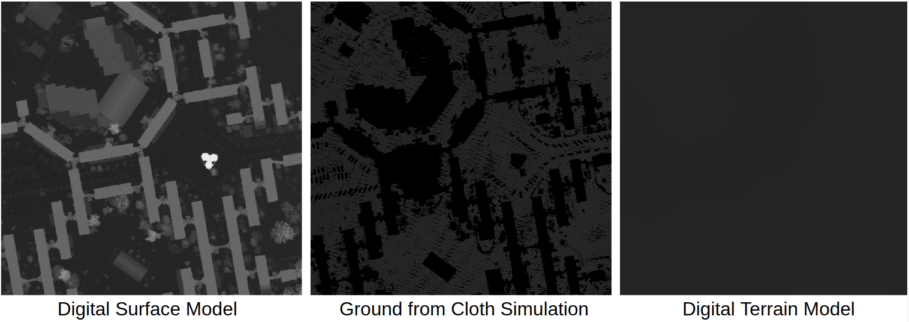

## Compute Digital Terrain Model

Software based on the Cloth Simulation method from [https://github.com/jianboqi/CSF](https://github.com/jianboqi/CSF)

The parameters are adjusted for AOIs of size around 600x600 px (resolution 0.3 m)

To install CSF: 

- `pip3 install CSF`

To run the software:

Use **python3 extract_dtm [1 2 3 4 5 6]** to run the software, where:

**1** (string) path to the txt file containing the input point cloud.

**2** (string) path to the txt file containing the utm bbox.

**3** (string) output directory.

**4** (string) directory containing [imscript](https://github.com/mnhrdt/imscript) binaries employed to post-process the DTM.

**5** (float) resolution used to project the cloud on the utm bbox.

**6** (boolean) indicates if intermediate results will be saved. **Note**: Use 0 to set False and 1 to set True.

The output .tif files containing the DTM and DSM will be stored at the output directory.

Exemple call:

- `python3 extract_dtm.py test/1_xyz.txt test/1_bb.txt output imscript/bin 0.35 0`
